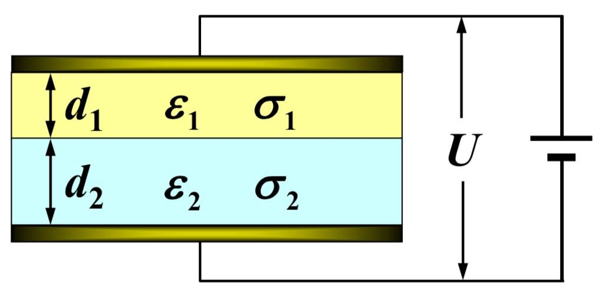

# 大学物理 电磁学期末复习

> 有错误欢迎指出~

# 12 静电场

\\(e=1.6\times 10^{-19}\rm C\\)

\\(\boldsymbol F_{21}=k\frac{q_1q_2}{r_{21}^2} \boldsymbol {e}_{r21}\\)

\\(k=9\times 10^9\rm N\cdot m^2/C^2\\)

\\(k=\frac{1}{4\pi\varepsilon_0}\\)

\\(\varepsilon_0=8.85\times 10^{-12}\rm C^2/(N\cdot m^2)\\)

\\(1\rm V/m=1\rm N/C\\)

\\(E=\frac{\text d \Phi}{\text d S_\perp}\\)

电通量: 通过面元的电场线条数 \\(\boldsymbol E\cdot \text d \boldsymbol S\\)

\\(\oint_S \boldsymbol E\cdot \text d \boldsymbol S=\frac{1}{\varepsilon_0}\sum q_{in}\\)

高斯定律比库仑定律更普遍

## 典型静电场

球面内 \\(E=0\\)

球面外 \\(E=\frac{q}{4\pi \varepsilon_0}\frac{1}{r^2}\\)

球体内 \\(E=\frac{q}{4\pi \varepsilon_0}\frac{r}{R^3}=\frac{\rho}{3\varepsilon_0} r\\)

球体外 \\(E=\frac{q}{4\pi \varepsilon_0}\frac{1}{r^2}\\)

长直导线 \\(E=\frac{\lambda}{2\pi\varepsilon_0 r}\\)

平面 \\(E=\frac{\sigma}{2\varepsilon_0}\\)

圆盘周线上的场强 \\(E=\frac{\sigma x}{2\varepsilon_0}[\frac{1}{\sqrt{x^2+R_1^2}}-\frac{1}{x^2+R_2^2}]\\)

## 电偶极子

沿 \\(\vec p\\) 方向的场强 \\(\boldsymbol E=\frac{2\boldsymbol p}{4\pi \varepsilon_0 r^3}\\)

中垂线上的场强 \\(\boldsymbol E=-\frac{\boldsymbol p}{4\pi \varepsilon_0 r^3}\\)

一般情况场强 \\(\boldsymbol E=\frac{1}{4\pi \varepsilon_0 r^3}[\frac{3(\boldsymbol r\cdot \boldsymbol p)\boldsymbol r}{r^2}-\boldsymbol p]\\)

力矩 \\(\boldsymbol M=\boldsymbol p\times \boldsymbol E\\)

# 13 电势

\\(\oint\boldsymbol E\cdot \text d \boldsymbol r=0\\)

\\(U_{12}=\varphi_1-\varphi_2\\)

\\(\varphi=\int_P^{\infty}\boldsymbol E\cdot \text d \boldsymbol r\\)

\\(1\text V = 1\rm J/C\\)

\\(\boldsymbol E=-\nabla \varphi\\)

一个电荷在电场中某点的电势能, 是属于该电荷与产生电场的电荷系所共有的, 是一种相互作用能

\\(1\text e\text V=1.6\times 10^{-19}\rm J\\)

电荷系在原来状态的静电能: 将电荷分散到无穷远 电荷间静电力所做的功

\\(W=\frac{1}{2}\sum q_i \varphi_i=\frac{1}{2}\int_q \varphi \text d q\\)

静电学中上式与 \\(W=\int_V w_e \text d V=\int_V \frac{\varepsilon_0 E^2}{2}\text d V\\) 等价

电偶极子电势 \\(\varphi=\frac{p\cos \theta}{4\pi\varepsilon_0 r^2}=\frac{\boldsymbol p\cdot \boldsymbol e_r}{4\pi\varepsilon_0 r^2}\\)

# 14 静电场中的导体

导体静电平衡的条件: \\(\boldsymbol E_{in}=\boldsymbol{0}, \boldsymbol E_S \perp 表面\\)

处于静电平衡的导体: \\(\sigma=\varepsilon_0 E\\)

有导体存在时静电场的计算: 静电场的基本规律, 电荷守恒, 导体静电平衡条件

静电屏蔽: 金属空壳的外表面上及壳外的电荷在壳内的合场强为 0, 因而对壳内无影响

唯一性定理：在给定条件下, 空间的电场分布和导体表面的电荷分布是唯一确定的
* (1) 给定每个导体的总电量
* (2) 给定每个导体的电势
* (3) 给定一些导体的总电量和另一些导体的电势

可简述为: 给定边界条件后, 静电场的分布就唯一地确定了

镜像法求电场

# 15 静电场中的介质

将介质插入电容器 \\(U=U_0/\varepsilon_r\ E=E_0/\varepsilon_r\ \varepsilon_r>1\\)

电荷分布不对称的分子: 极性分子, 有固有电矩

正负电荷中心重合: 非极性分子, 无固有电矩. 外加电场会产生比固有电矩小得多的感生电矩

出现在电介质表面的电荷叫面束缚电荷 / 面极化电荷

分子电矩 \\(\boldsymbol p=q\boldsymbol l\\)

电极化强度: 单位体积内分子电矩矢量和 \\(\boldsymbol p=\frac{\sum \boldsymbol p_i}{\Delta V}\\)

\\(\boldsymbol P=n\boldsymbol p\\), \\(n\\) 为电介质单位体积内的分子数, 单位 \\(\rm C/m^2\\)

电极化强度 \\(\boldsymbol P=\varepsilon_0(\varepsilon_r -1)\boldsymbol E\\)

电极化率 \\(\chi =\varepsilon_r -1\\)

面束缚电荷 \\(\sigma ' = \boldsymbol P\cdot\boldsymbol e_n\\) \\(\boldsymbol e_n\\) 由介质指向真空

体束缚电荷 \\(q_{in} '=-\oint \boldsymbol P\cdot\text d\boldsymbol S\\)

\\(\rho'=-\nabla \cdot \boldsymbol P\\)

电位移 \\(\boldsymbol D=\varepsilon_0 \boldsymbol E+\boldsymbol P\\)

\\(\oint \boldsymbol D\cdot \text d \boldsymbol S=\sum q_{0in}\\) \\(q_{0in}\\) 是自由电荷

\\(\boldsymbol D=\varepsilon \boldsymbol E=\varepsilon_0\varepsilon_r \boldsymbol E\\)

边界条件 \\(E_{1t}=E_{2t}\\) \\(D_{1n}=D_{2n}\\)

电容器 \\(C=\frac{Q}{U}\\)

电容器并联相加, 串联倒数相加

电介质填充两种规律
* (1) 按等势面填充: \\(\boldsymbol {D}\\) 不变, \\(\boldsymbol {E}\\) 变
* (2) 按电场线填充: \\(\boldsymbol {D}\\) 变, \\(\boldsymbol {E}\\) 的分布“样子”不变

电容器的能量 \\(W=\frac{1}{2}CU^2=\frac{1}{2}QU=\frac{1}{2}\frac{Q^2}{C}\\)

电场中的能量体密度 \\(w_e=\frac{1}{2}DE=\frac{1}{2}\varepsilon E^2\\)

电场中的能量 \\(W=\int \frac{1}{2}\varepsilon E^2 \text d V\\)

## 电容器公式

平行板电容器 \\(C=\frac{\varepsilon S}{d}\\)

圆柱形电容器 \\(C=\frac{2\pi L\varepsilon}{\ln (R_2/R_1)}\\)

球形电容器 \\(C=\frac{4\pi R_1 R_2 \varepsilon}{R_2-R_1}\\)

球形孤立导体电容器 \\(C=4\pi R\varepsilon\\)

# 16 恒定电流

电流 \\(I\\) 又叫电流强度

电流密度 \\(\text d I=\boldsymbol J\cdot \text d \boldsymbol S\\)

电流 / 电流密度通亮 \\(I=\int_S \boldsymbol j \cdot \text d \boldsymbol S\\)

\\(\boldsymbol J=qn\boldsymbol v\\)

\\(I=\int_S \boldsymbol J\cdot \text d \boldsymbol S=-\frac{\text d q_{in}}{\text d t}\\)

微分形式 \\(\frac{\partial \rho}{\partial t}+\nabla \cdot \boldsymbol j=0\\)

若 \\(\oint_S \boldsymbol J\cdot \text d \boldsymbol S=0\\), 则 I 为恒定电流

恒定电场与静电场都服从高斯定律和场强环路积分为零的环路定理

\\(R=\rho\frac{l}{S}=\frac{l}{\sigma S}\\)

\\(\boldsymbol J=\sigma \boldsymbol E\\)

物质导电性能方程 \\(\boldsymbol j=\sigma\cdot\boldsymbol E\\)

\\(\boldsymbol j=\sigma\cdot\boldsymbol E\\) 比 \\(U=IR\\) 适用范围更广, 对非均匀导体成立, 对非稳恒电流也成立

稳恒电流和静电场的综合求解的基本方程:

稳恒条件 \\(\oint_S \boldsymbol J\cdot \text d \boldsymbol S=0\\)

环路定理 \\(\oint \boldsymbol E\cdot \text d\boldsymbol l=0\\)

欧姆定律 \\(\boldsymbol j=\sigma\cdot\boldsymbol E\\)

界面关系 \\(j_{1n}=j_{2n}\\), \\(E_{1t}=E_{2t}\\)

## 电容器充电和放电

**充电**

\\(q=C\varepsilon(1-e^{-\frac{t}{RC}})\\)

\\(i=\frac{\varepsilon}{R}e^{-\frac{t}{RC}}\\)

\\(u_c=\varepsilon(1-e^{-\frac{t}{RC}})\\)

**放电**

\\(q=Qe^{-\frac{t}{RC}}\\)

\\(i=\frac{Q}{RC}e^{-\frac{t}{RC}}\\)

\\(u_c=\frac{Q}{C}e^{-\frac{t}{RC}}\\)

电容器时间常量 \\(\tau =RC\\) 若回路的线度比距离 \\(c\tau\\) 小得多，电场可按恒定电场处理

## 例题

在平行板电容器内填充两层导电介质, 厚度、介电常数和电导率分别为 \\((d_{1}, \varepsilon_{1}, \sigma_{1})\\)

和（\\(d_2, \varepsilon_{2}, \sigma_{2}\\) ），设电容器两端电压为 \\(\boldsymbol{U}\\)

求:
* (1)两介质中的电流密度和电场强度。
* (2)介质分界面上的总电荷面密度 \\(\sigma_{e}\\) 和自由电荷面密度 \\(\sigma_{e 0}\\)

解:

(1)由对称性和界面关系: \\(j_{1}=j_{2}=j\\)

电场强度: \\(\quad E_{1}=\frac{j}{\sigma_{1}}, \quad E_{2}=\frac{j}{\sigma_{2}}\\)

电压关系: \\(\quad U=E_{1} d_{1}+E_{2} d_{2}\\)

解得: \\(\quad j_{1}=j_{2}=j=\frac{\sigma_{1} \sigma_{2}}{\sigma_{1} d_{2}+\sigma_{2} d_{1}} U\\)

\\(E_{1}=\frac{\sigma_{2}}{\sigma_{1} d_{2}+\sigma_{2} d_{1}} U, \quad E_{2}=\frac{\sigma_{1}}{\sigma_{1} d_{2}+\sigma_{2} d_{1}} U\\)

(2)在界面选扁柱画作少高斯面 \\(S\\)

分别用 \\(\boldsymbol{E}\\) 和 \\(\boldsymbol{D}\\) 的高斯定理:

\\(\sigma_{e}=\varepsilon_{0}\left(E_{2}-E_{1}\right)=\frac{\varepsilon_{0}\left(\sigma_{1}-\sigma_{2}\right)}{\sigma_{1} d_{2}+\sigma_{2} d_{1}} U\\)

\\(\sigma_{e 0}=D_{2}-D_{1}=\varepsilon_{2} E_{2}-\varepsilon_{1} E_{1}=\frac{\varepsilon_{2} \sigma_{1}-\varepsilon_{1} \sigma_{2}}{\sigma_{1} d_{2}+\sigma_{2} d_{1}} U\\)

# 17 磁场和它的源

在所有情况下, 磁力都是运动电荷之间相互作用的表现.

洛伦兹力 磁感应强度 \\(\boldsymbol F=q\boldsymbol v\times\boldsymbol B\\)

\\(1\text T=10^4\rm G\\)

磁通量 \\(\Phi=\int_S \boldsymbol B\cdot\text d\boldsymbol S\\)

毕奥 - 萨伐尔定律 \\(\text d  \boldsymbol B=\frac{\mu_0}{4\pi}\frac{I\text d\boldsymbol l\times\boldsymbol e_r}{r^2}\\)

真空磁导率 \\(\mu_0=\frac{1}{\varepsilon_0 c^2}=4\pi\times 10^{-7}\rm N/A^2\\)

\\(c=\frac{1}{\sqrt{\mu_0\varepsilon_0}}\\)

磁通连续性定理 \\(\oint \boldsymbol B\cdot\text d\boldsymbol S=0\\)

\\(\text d  \boldsymbol B=\frac{\mu_0}{4\pi}\frac{q\boldsymbol v\times\boldsymbol e_r}{r^2}\\)

安培环路定理 \\(\oint \boldsymbol B\cdot \text d \boldsymbol r =\mu_0\sum I_{in}\\)

\\(\oint\boldsymbol B\cdot\text d\boldsymbol r=\mu_0\int_S\left(\boldsymbol J_c+\varepsilon_0\frac{\partial \boldsymbol E}{\partial t}\right)\cdot \text d \boldsymbol S\\)

传导电流 \\(I_c\\)

位移电流 \\(I_d=\varepsilon_0 \frac{\text d\Phi}{\text d t}=\varepsilon_0\frac{\text d}{\text d t}\int_S\boldsymbol E\cdot \text d\boldsymbol S\\)

位移电流密度 \\(\boldsymbol J_d=\varepsilon_0\frac{\partial \boldsymbol E}{\partial t}\\)

全电流 \\(I=I_c+I_d\\)

## 典型电流分布的磁场

无限长直电流 \\(B=\frac{\mu_0 I}{2\pi r}\\)

一段直导线 \\(B=\frac{\mu_0 I}{4\pi r}(\cos \theta_1-\cos \theta_2)\\)

无限长均匀载流薄圆筒 \\(B_ 内 =0, B_ 外 =\frac{\mu_0 I}{2\pi r}\\)

无限长直载流密绕螺绕管 / 螺绕环 \\(B_ 内 =\mu_0 n I, B_ 外 =0\\) 对于螺绕环 \\(n=\frac{N}{2\pi r}\\)

无限大平面电流 \\(B\cdot 2l=\mu_0 j l\\)

圆电流圈中心点和轴线上的磁场 \\(B_{中心}=\frac{\mu_0 I}{2R}, B_{轴线}=\frac{\mu_0 IS}{2\pi(R^2+x^2)^{3/2}}\\)

## 磁矩

\\(\boldsymbol B=\frac{\mu_o}{4\pi r^3}[\frac{3(\boldsymbol r\cdot \boldsymbol m)\boldsymbol r}{r^2}-\boldsymbol m], (r>> 磁矩线度)\\)

磁矩、电流圈在外磁场中的势能 \\(W=-\boldsymbol m\boldsymbol B_ 外 =-IS\cdot \boldsymbol B_ 外\\)

## 例题

半径 \\(R\\) 的圆形平行板电容器内充满介电 常数 \\(\varepsilon\\) 、磁导率 \\(\mu\\) 的均匀介质，如图已知电容器充电时的 \\(\frac{\mathrm{d} E}{\mathrm{d} t}\\) 及其方向，忽略边缘效应

求:\\(i_d\\)和\\(B_p\\) \\((r<R)\\)

对圆面 \\(S\\) 有:

\\(I_{d} =\iint_{S} \frac{\partial \boldsymbol{D}}{\partial t} \cdot \mathbf{d} \boldsymbol{S}=\iint_\boldsymbol{s}\varepsilon\frac{\mathbf{d} \boldsymbol{E}}{\mathbf{d} t}\mathbf{d} \boldsymbol{S}=\varepsilon \frac{\mathbf{d}\boldsymbol{E}}{\mathbf{d} t}\pi R^2\\)

过 P点垂直轴线作环形回路 \\(L\\), 方向和圆面 \\(S^{\prime}\\) 成右手关系:

\\(\oint_{L} \boldsymbol{H} \cdot \mathbf{d} \boldsymbol{l}=\boldsymbol{H} \cdot \boldsymbol{2} \pi \boldsymbol{r}=\sum \boldsymbol{I}_{d内}\\)

\\(\sum I_{d内}=\iint_{S^{\prime}} \frac{\partial \boldsymbol{D}}{\partial t} \cdot \mathbf{d} \boldsymbol{S}=\pi r^{2} \boldsymbol{\varepsilon} \frac{\mathbf{d} \boldsymbol{E}}{\mathbf{d} t}\\)

\\(H_{P}=\frac{\varepsilon r}{2} \frac{d E}{d t}\\)

\\(B_{P}=\mu H_{P}=\frac{\mu \varepsilon r}{2} \cdot \frac{d E}{d t}\\)

# 18 磁力

\\(r=\frac{mv}{Bq}\\)

\\(T=\frac{2\pi m}{Bq}\\)

螺旋运动的螺距 \\(h=\frac{2\pi m}{Bq}v_{//}\\)

霍尔效应 \\(U_H=\frac{IB}{nqb}\\)

\\(\boldsymbol F=\int_L I\text d \boldsymbol l\times \boldsymbol B\\)

磁矩 \\(\boldsymbol m=SI\boldsymbol e_n\\)

力矩 \\(\boldsymbol M=\boldsymbol m\times \boldsymbol B\\)

# 19 磁场中的磁介质

\\(B=\mu_r B_0\\), \\(\mu_0\\) 为相对磁导率

磁化强度 \\(\boldsymbol M=\frac{\sum \boldsymbol m_i}{\Delta V}\\)

\\(\boldsymbol M=\frac{\mu_r-1}{\mu_0\mu_r}\boldsymbol B\\)

面束缚电流密度 \\(\boldsymbol j'=\boldsymbol M\times \boldsymbol e_n\\)

总束缚电流 \\(I'=\oint \text d I'=\oint_L\boldsymbol M\cdot \text d \boldsymbol r\\)

磁感应强度 \\(\boldsymbol B=\boldsymbol B_0+\boldsymbol B'\\)

磁场强度 \\(\boldsymbol H=\frac{\boldsymbol B}{\mu}=\frac{\boldsymbol B}{\mu_0}-\boldsymbol M\\)

\\(\oint_L \boldsymbol H\cdot \text d \boldsymbol r=\sum I_{0in}\\)

磁场的边界条件 \\(H_{1t}=H_{2t}\\), \\(B_{1n}=B_{2n}\\)

磁感线穿过两介质分界面 \\(\frac{\tan \theta_1}{\tan \theta_2}=\frac{\mu_{r1}}{\mu_{r2}}\\)

用封闭铁盒可以实现磁屏蔽

# 20 电磁感应

感应电动势 \\(\mathscr{E}=\frac{\text d \Psi}{\text dt}=-N\frac{\text d \Phi}{\text d t}\\)

当穿过各匝线圈的磁通量相等时,N 匝线圈的全磁通为 \\(\Psi=N\Phi\\)

动生电动势 \\(\mathscr E=\oint_L(\boldsymbol v\times\boldsymbol B)\text d\boldsymbol l\\)

\\(|\mathscr E|=Blv\\)

感生电动势 \\(\oint_L\boldsymbol E_i\cdot \text d\boldsymbol l=-\frac{\text d\Phi}{\text dt}=-\int_S \frac{\partial \boldsymbol B}{\partial t}\cdot \text d\boldsymbol S\\)

其中 \\(E_i\\) 表示感生电场, 由于静电场的环路积分为零, 所以

\\(\oint_L\boldsymbol E\cdot \text d\boldsymbol r=-\int_S \frac{\partial \boldsymbol B}{\partial t}\cdot \text d\boldsymbol S\\)

\\(\Psi_{21}=M_{21}i_1\\)

\\(\mathscr E_{12}=-\frac{\text d\Psi_{21}}{\text dt}=-M_{21}\frac{\text di}{\text dt}\\)

\\(M_{21}\\) 是回路 \\(L_1\\) 对回路 \\(L_2\\) 的互感系数, 固定回路的互感系数是一个常数,\\(M_{21}=M_{12}=M\\), \\(M\\) 称作这两个导体回路的互感系数, 简称他们的互感

\\(\mathscr E_{L}=-\frac{\text d\Psi}{\text dt}=-L\frac{\text di}{\text dt}\\), \\(L=\frac{\Psi}{i}\\) 为自感系数, 简称自感

自感磁能 \\(W_m=\frac{1}{2}LI^2\\)

磁场的能量 \\(W_m=\frac{B^2}{2\mu}V=\int \frac{BH}{2}\text dV\\)

磁能量密度 \\(w_m=\frac{1}{2}BH\\)

# 21 麦克斯韦方程组和电磁辐射

真空中的电磁场规律

\\[
\left\\{\begin{array}{l}
\oint_{S} \boldsymbol{E} \cdot \mathrm{d} \boldsymbol{S}=\frac{q}{\varepsilon_{0}}=\frac{1}{\varepsilon_{0}} \int_{V} \rho \mathrm{d} V
\\\\
\oint_{S} \boldsymbol{B} \cdot \mathrm{d} \boldsymbol{S}=0
\\\\
\oint_{L} \boldsymbol{E} \cdot \mathrm{d} \boldsymbol{r}=-\frac{\mathrm{d} \Phi}{\mathrm{d} t}=-\int_{S} \frac{\partial \boldsymbol{B}}{\partial t} \cdot \mathrm{d} \boldsymbol{S}
\\\\
\oint_{L} \boldsymbol{B} \cdot \mathrm{d} \boldsymbol{r}=\mu_{0} I+\frac{1}{c^{2}} \frac{\mathrm{d} \Phi_{\mathrm{e}}}{\mathrm{d} t}=\mu_{0} \int_{s}\left(\boldsymbol{J}+\varepsilon_{0} \frac{\partial \boldsymbol{E}}{\partial t}\right)\cdot \mathrm{d} \boldsymbol{S}
\end{array}
\right\\}
\\]

有介质的情况下

\\[
\left\\{\begin{array}{l}
\oint_{S} \boldsymbol{D} \cdot \mathrm{d} \boldsymbol{S}=\int_{V} \rho_0 \mathrm{d} V \\\\
\oint_{S} \boldsymbol{B} \cdot \mathrm{d} \boldsymbol{S}=0 \\\\
\oint_{L} \boldsymbol{E} \cdot \mathrm{d} \boldsymbol{r}=-\int_{S} \frac{\partial \boldsymbol{B}}{\partial t} \cdot \mathrm{d} \boldsymbol{S} \\\\
\oint_{L} \boldsymbol{H} \cdot \mathrm{d} \boldsymbol{r}=\int_{S}\left(\boldsymbol{j}_0+\frac{\partial \boldsymbol{D}}{\partial t}\right)\cdot \mathrm{d} \boldsymbol{S}
\end{array}
\right\\}
\\]

表述为微分形式

\\[
\left\\{\begin{array}{l}
\nabla \cdot \boldsymbol{D}=\rho_0 \\\\
\nabla \cdot \boldsymbol{B}=0 \\\\
\nabla \times \boldsymbol{E}=-\frac{\partial \boldsymbol{B}}{\partial t} \\\\
\nabla \times \boldsymbol{H}=\boldsymbol{j}_0+\frac{\partial \boldsymbol{D}}{\partial t}
\end{array}
\right\\}
\\]

对于各向同性的线形介质, 有

\\[
\boldsymbol{D}=\varepsilon_{0} \varepsilon_{\mathrm{r}} \boldsymbol{E}, \quad \boldsymbol{B}=\mu_{0} \mu_{\mathrm{r}} \boldsymbol{H}, \quad \boldsymbol{j}_0=\sigma \boldsymbol{E}
\\]

洛伦兹力公式

\\(\boldsymbol{F}=q\boldsymbol{E}+q\boldsymbol{v}\times\boldsymbol{B}\\)

界面关系

\\[
\left\\{\begin{array}{l}
E_{1t}=E_{2t}\\\\
D_{1n}-D_{2n}=\sigma_0\\\\
H_{1t}-H_{2t}=(\boldsymbol{i_0}\times\boldsymbol{e_n})\cdot\boldsymbol{e_t}\\\\
B_{1n}=B_{2n}
\end{array}
\right\\}
\\]

## 平面电磁波是横波

右手关系 \\(\frac{\boldsymbol{E}}{E}\times\frac{\boldsymbol H}{H}=\frac{\boldsymbol u}{u}\\)

振幅关系 \\(\sqrt{\mu}H=\sqrt{\varepsilon}E\\)

\\(\frac{E}{B}=\frac{1}{\sqrt{\varepsilon\mu}}=u\\)

波速、折射率 \\(u=\frac{1}{\sqrt{\varepsilon\mu}}\\) \\(c=\frac{1}{\sqrt{\varepsilon_0\mu_0}}\\) \\(n=\sqrt{\varepsilon_r\mu_r}\\) \\(u=\frac{c}{n}\\) (对于非铁磁质 \\(n=\sqrt{\varepsilon_r\mu_r}\approx\sqrt{\varepsilon_r}\\))平面电磁波的能量密度 \\(w=\varepsilon E^2=\frac{EH}{u}\\)

单位时间内通过与传播方向垂直的单位面积的能量, 叫电磁波的能流密度, 其时间平均值就是电磁波的强度. 能流密度矢量 \\(\boldsymbol S\\) 又被称作波印亭矢量

\\(\boldsymbol S=\boldsymbol E\times\boldsymbol H\\)

\\(\boldsymbol S_{//}\\) 沿导线由电源传向负载

\\(\boldsymbol S_{\perp}\\) 沿径向由外向内传播，补偿导线的焦耳热损耗

电磁波质量密度 \\(m=\frac{w}{c^2}=\frac{EH}{c^2u}\\)

电磁波动量密度 \\(\boldsymbol g=m\boldsymbol u=\frac{1}{c^2}\boldsymbol E\times\boldsymbol H=\frac{\boldsymbol S}{c^2}\\)

辐射压强 全反射 \\(p_r=2g\cdot c=2\frac{EH}{c}\\) 全吸收 \\(p_r'=g\cdot c=\frac{EH}{c}\\)
