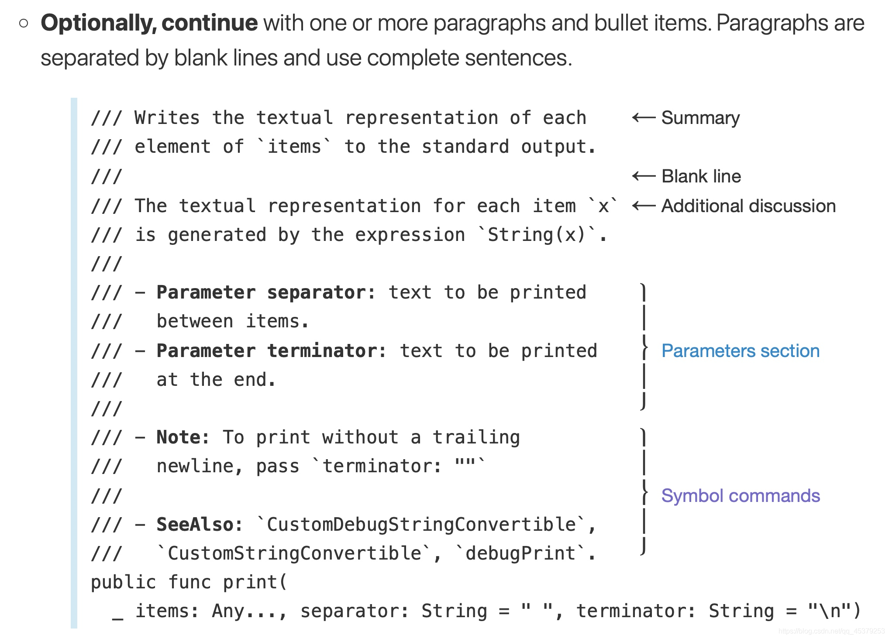

# Swift Markup Syntax

[Apple Developer | Markup Formatting Reference](https://developer.apple.com/library/archive/documentation/Xcode/Reference/xcode_markup_formatting_ref)

[See All Marking Up Here](https://developer.apple.com/library/archive/documentation/Xcode/Reference/xcode_markup_formatting_ref/MarkupFunctionality.html)

I seperate them into two parts: formats of style and keywords using in documentation.

## Styles

```
Block Comment /** */
Bulleted Lists -
Code Block ```
Code Voice `
Emphasis Italics * * or _ _
Escapes \ (to enter)
Headings # ## ###
Horizontal Rule - - - or * * *
Images 
Link Reference []:
Links []()
Numbered Lists 1. 2.1.1
Single Line Comment ///
Strong ** ** or __ __
```

##  Keywords

See all keywords at [Swift | API Design Guidelines](https://swift.org/documentation/api-design-guidelines/)

{width="400"}

## How to use

Check more at [Swift | API Design Guidelines](https://swift.org/documentation/api-design-guidelines/).

{width="400"}
