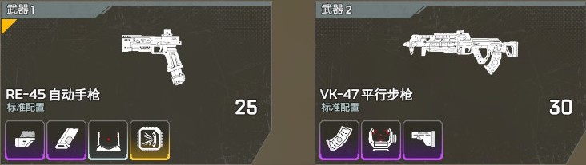

# Apex 17 赛季上分

## 背包管理

以白包 12 格为基准，蓝包和紫包多带投掷物

- `轻型弹药 x 4` `重型弹药 x 2`
- `小药 x 1` `大药 x 1`
- `电 x 4`

## 武器

R99 / RE45 + 3030 / 平行

## 靶场练习

- 定位（打靶中心点/打假人爆头）
    - **50m 自己不动 金弹匣机瞄/一倍方镜平行 单发**
    - 100m 自己不动 金弹匣三倍镜平行 单发（需要考虑下坠）
- 压枪（打静止假人）
    - **50m 自己不动 金弹匣机瞄/一倍方镜R99**
    - 50m 自己不动 金弹匣机瞄/一倍方镜平行 连发
- 持续跟枪（打匀速假人）
    - **50m 自己不动 金弹匣机瞄/一倍方镜R99**
    - **20m 自己不动 金弹匣R99 腰射**
    - 50m 自己不动 金弹匣机瞄/一倍方镜平行 连发
- 变向跟枪（打随机假人）
    - **20m 自己随着假人左右移动 金弹匣R99 腰射**
- 全面战斗
    - 传奇选命脉
    - 单持金弹匣一倍方镜R99
