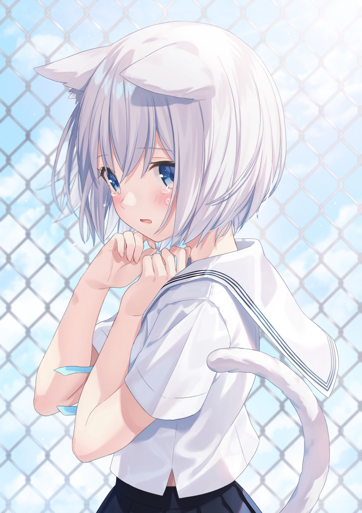

# 喜欢的画

> 下面的图经过压缩

---

<https://www.pixiv.net/en/artworks/64668042>

虚无的眼神 蒲公英般柔软的身体

---

<https://www.pixiv.net/en/artworks/69081691>

最喜欢的一张画 蓝白色校服与天空交融 みぞれ的眼看向别处 若有所思 翻飞的乐章将画面扩展到天空

---

<https://www.pixiv.net/en/artworks/86141916>

普普通通的初中生 おはよう

---

<https://www.pixiv.net/en/artworks/89793179>

失落表现的恰到好处 耳朵下垂 让人很想摸头 手轻轻捏着 虽说伤心但是尾巴却翘着 仿佛内心有些开心的想法 校服下方的开口恰到好处 青春如此展现在面前

---

淡粉红色伴着微笑与清风 这大概就是夏日的气息吧

---
