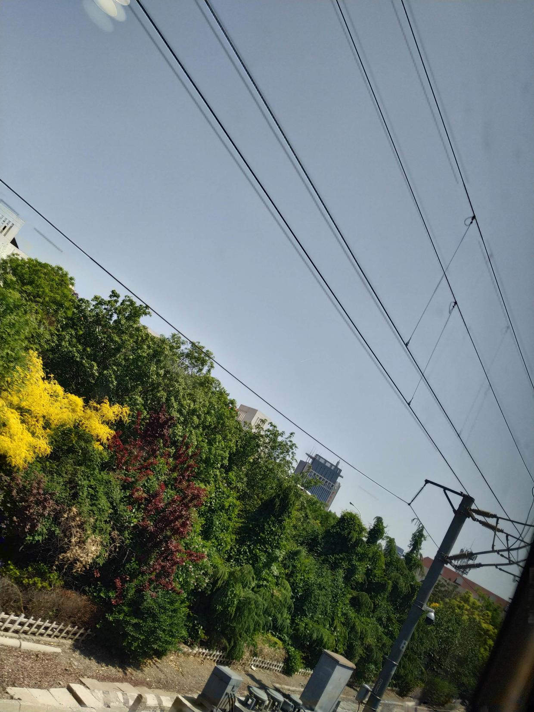
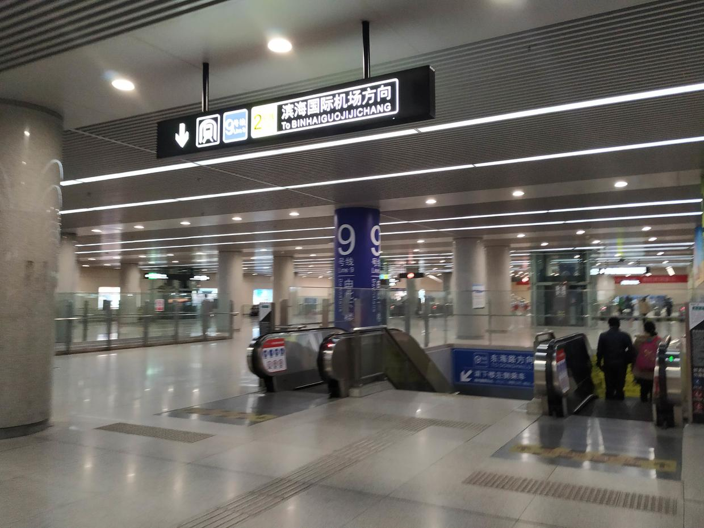
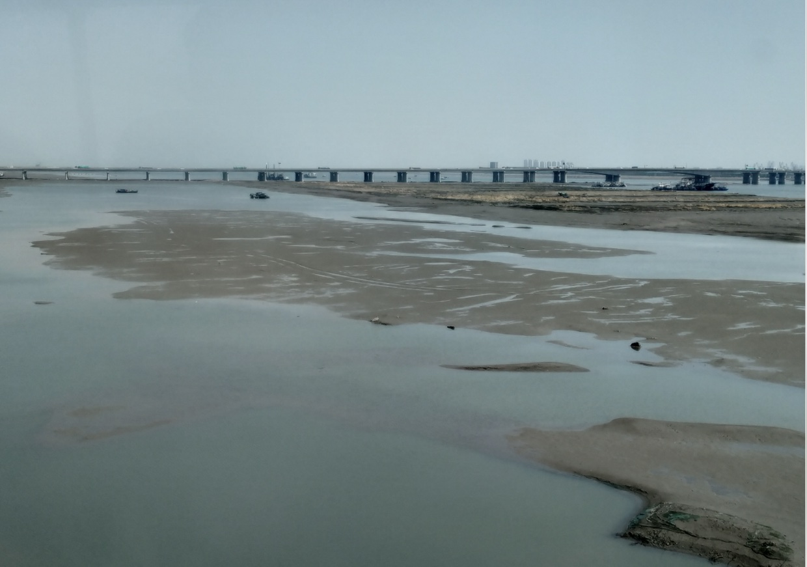

# 只要向前 路就会延伸

> Written on 210502
> 
> Edited on 210504

记录一下经历

## 前言

昨天（1号）中午（13:00）起床，去紫荆负一吃饭，出来抬头突然看到紫四和楼顶的蓝天，加上旁边的树，突然就让我想到了海边：蓝白色的天，蓝色的海水，沙滩，椰子树。当时的第一反应是：海に行きたい。（想去海边）回到宿舍就在想，为什么，不去呢？反正作业也写的差不多了，虽然假期也有其他的打算，但总觉得，这是个更想去实现的事情，就是想看大海，就是想走出校园，想产生和日常不同的经历，想做别人不会做的事情。

然后我看了本书，看了几段论文，和舍友跑了步，吃完饭，回宿舍。这个过程都很平静。

但是回到宿舍之后，就突然想将中午的想法付诸实践了。开始查地点——发现最近的就是天津的滨海新区；还看了不少景点，要不就是很远，要不就是评级不太好。因为是临时兴起，所以我也不太打算在外面住一夜，假期的后三天还是想在图书馆度过。开始查车票——这是就犯了难：第二天早上从北京到天津的车票，直达离海最近的地方的话，最晚有票的是6:40，嘛，因为热情还是有的，所以觉得，也可以。但舍友说如果晚一点、时间安排好的话，他也可以一起去。后来先是抢了两张12:40从北京南到天津南的票（好不容易抢的，节假日抢票太痛苦了），之后我去摸鱼了。结果到了零点，舍友仔细一斟酌，说12:40过去的话，搞不了什么事情啊，有点晚；其实我也觉得这样不太靠谱，因为天津南是离海很远的，倒地铁还得多个30min；然后就把舍友的票退了。差不多0:40，我想着一个人去，也可以考虑把票往前买一点，最后也退了票买到11:40出发到天津的，这样提前一个小时，路上还节省一个小时，美哉。

滨海新区

我当然没有做什么详细的规划，我只是想看海，就这一个目的。大概的思路是，去海洋博物馆那边（9号线倒游2），然后自己到海边；另一种是去东疆湾景区那边，但景区本身可能不太好，我打算在那个路上看一看。那么怎么过去呢？要不就是滴滴，要不就是共享单车。我能想到的只有这两种。

换完票已经一点半了，又因为晚上就很兴奋，所以，五点半才困，然后睡觉。神奇吧！九点多起来吃饭，去C超买吃的（两瓶酸奶一包薯片两种面包），虽然有那么一丢丢迷糊，但仍然是情绪高涨，就骑着车向西门出发（9:40）。从西门出去，看到圆明园门口排着长队，我就知道，那不是我的归宿，我想去人少的地方，我想看自己想看的东西，而不是去别人想去的地方。

地铁很快，人不太多。刷了刷微博了解了昨天西站的事情，实在是有些感慨，我觉得但凡西站有那么几个组织能力优秀的人，不至于乱成这个样子。到南站（10:40）差不多还有一个小时发车吧，打了两把雀魂，就剩三十点就能升段，硬生生又掉了六十点。于是带着这样悲惨的心情出发——

高铁（11:45）上没什么风景；换乘九号线（12:22），地上部分，我觉得也没什么风景，得亏我还一直站在门口看着外面呢（哭）。觉得滨海新区这边，好像是工业比较多，也可能是市区和新开发区中间是这样，但其实当我真正到了滨海新区，我也觉得，它并不是那么宜居、可欣赏的地方，基础设施是蛮老旧的，没有施工的地方不少店铺都没开或者开了之后关掉，或者就是正在施工 围栏围起来，尘土堆着。晚上在地铁站也有感受，有的服务也差那么一点，也有可能是因为我和首都在比较吧；觉得，这不像是一个开发区，不像是所谓“新区”，这一点说实话很失望。

高铁出发前

高铁路上

高糊九号线

拍到了九号线自己的铁轨

九号线下了之后立刻换乘公交（13:49），和公交车上的一个师傅聊了聊，他说有个地方能看到海还有沙滩，但他的天津话我没太听懂啊（捂脸），没搞清楚到底是哪个景点还有沙滩ww。车上打开了菠萝面包，喝了酸奶；下了一堆可能需要的软件，比如滴滴，比如美团，比如哔哩哔哩直播姬；和舍友WeChat文本直播……然后我意料不到的事情发生了！

等公交 满是电动共享车

公交车上抓拍

## 中章

到了海洋博物馆那边（14:30），我的任务不是博物馆，而是离它大概两公里的海边。4G信号特别差。我要扫美团的那个电动车，结果我登陆，手机号都发不到服务器……拆了薯片慢悠悠吃完，我终于骑上了电动车hh。骑上之后，突然发现，原来电动车是这么的轻松；这是我第一次骑电动车，只能说太舒服了，难怪学校这么多人骑电动车。突然就想起来秒五里面的那个岛，男主和一位女主总是骑着摩托车/电动车上下学，因为太远了；如果他们骑车的时候是这么轻松，那么他们会用这些时间想着什么东西吧，想着什么呢？

美好的愿景是：我骑着电动车，到达海边。但问题是，这个电动车是有区域限制的，出了限制的区域，那电动车就取消助力，也就是，不提供电力。不巧的是，从海洋博物馆到海边，差不多四公里，其中只有20%在区域内。哭了。不妨先走走看。骑到了20%的地方，路被封了，车过不去；这里是一个湖，有那么点海的意思，但是没有海的神韵，看了看，喊一句「まだまだ！」（还不够！），继续推着电动车从小路出发。这条路直接通往海边，双向两车道，左右有自行车道。到这里（15:00）差不多是三点了。和一个走路到海边又走回来的人聊，他说他慢悠悠走，来回三个小时。说，如果我能骑电动车的话，40min应该能过去。二话不说直接出发。

小湖

斜着又拍了一张

这时我在20%的地方，已经是共享电动车的区域之外了。虽然网不好让我发消息登陆软件都等很久，Bilibili直播的心情也没有了，但是，信号差让这个电动车也没法联网，它没识别出来现在已经出来了！所以我就骑啊骑啊，骑到80%一声响，停了。害这没办法只能自己骑了；真的沉啊，不如直接下来推着走（笑哭）；btw，电动车不能离开我身边，不然可能我就回不去了……
前往海边的路

天空很蓝哦

只剩20%当然没什么问题，很快就到了（15:22），到了开了录像，第一句话是：啊 好冷！海风吹过来，尽管大太阳照着，还是有点冷；其实路上风就已经很大了，跟舍友打电话他说他完全听不清hh。

看到了看到了！

海上的天空

回到初心：我想去看海，只是因为紫四头顶的蓝天吗？不是。我想，在THU中的我，总是被不同的建筑包围：我是那个凹下去的点，建筑四周凸起来，有的时候就很闷；但是在海边，海面是凹下去的，我无法感受到那份包围感，有的只是近处的拍打着的波涛和远处平静的海平线，以及，被环境同化的我。有的时候也想去找天台，尤其是很高的建筑物的顶层，它们也能给我带来这样的感受；但在中国，这种地方真的很少；即使找到了，看到的，也很难是我想看到的风景。

我只是想体验这样的一种感觉吗？是的，只是这样的一个执念，我想在最快的时间实现它。舍友说，不如五月四号一块去？我想，我一号想去，二号要是不去，也许三号就不想去了，有些事情，我一点也不愿意拖，哪怕一点。其实很多事情，只要你愿意去做，总是会有进展的（只要前进，路总会延伸）。很神奇，早上从清华出发，下午到海边。可要知道，这是从首都出发，在北方，一天之内，看海。蛮幸运的，一路风顺，如愿以偿。最开心的是，这是我的选择。很多时候都会感慨，如果，当时我没那么想，没那么做，没那么主动，事情又会怎样呢？有什么做的好的事情，在感谢完那些贡献过帮助的人之后，总会想想自己的选择，是否也为 什么 开辟了道路呢？

细细看海，也许是一种平静吧。为什么之前的湖就不行呢？因为它没有完整的和这个地球的海连成一片。看着眼前，近处是棕黄色的，远处是青蓝色；远处的天有点灰蒙蒙的，不过也算是和海连在了一起，近处的蓝天白云倒是直接呈现在眼前……我想起Big Sur、想起Catalina，也许以后也有机会去看看呢～

一本满足的我，踏上回程；也许，多待一会儿是更好的选择，因为我并不赶时间；也许，待一会儿也够了，因为我不需要太多，我也不能沉溺。

## 终章

吃了一个豆沙面包，开了新的一瓶酸奶，网易云音乐外放音量拉满，继续骑着小电驴走在双向两车道的边上。有时挺危险的，有次一个车从我左边占自行车道超车，从我身边擦过的一瞬间，心脏骤停，再别让我见到这种“控制精良”的司机了，怕是再有个1cm我就没了好嘛；但大多时候还是车尾气，说实话，有点难受。回程远海，风很小，也很热，脸上汗也没怎么停。回程可没有电动车的60%了，80%全靠自己；嘛，有旋律相伴，倒是也干劲十足。

回程

生态城风景

在获得电动车动力之后，又在那一片转了转，转回最开始放电动车的地方去坐游2公交。

这时发生了一段对话：

> 是在这里坐公交车吗？
> 
> 是
> 
> emmm大概要等多久啊
> 
> 不知道，好像一辆比较久。拼出租车也挺便宜的
> 
> 你等了多久啊
> 
> 二十多分钟吧
> 
> 哦哦 你去那边的博物馆
> 
> 啊 来了没带身份证也没预约 没看成
> 
> 我去看海了 就一直往那边走
> 
> （车来了）
> 
> 哇 看来我运气比较好，刚到车就来了
> 
> 哈哈

一位很普通的少年，背着斜挎包，看上去稍微有一点失落；每一句话都给人一种随和的感觉。上车之后就继续聊了，结果越聊越投入。不是学长，也不是学弟，天津某个大学的大二学生，学机械。感觉五一假期没什么事做，出来玩，但是没规划好，结果没看成；舍友也没跟着一起。这不是和前一天才做决定的我差不多么。聊着聊着惊喜的发现，我俩，还都是宝鸡人！哈哈，偶然遇到的一个人，竟然是老乡，还是同一个市的。聊了好多好多，什么学业、父母、社团、二次元；加了微信；一起换乘了地铁，我在靠前的一站下车。

这就是缘分吧，这就是运气。人生就是会发生很多这样的事情，我完全不会想到，临时起意去看海的回程，随意搭话的一个人，竟然是和自己同龄的大学生，还是老乡。「这就叫遇见吧」

再后面（18:00），去了一座高楼旁边，想去最高层看看，但是观光的地方没开，保安不让上去。之后骑车去了高铁站。运气很不好的是，那一片都是高架，我骑着自行车，那个星号德导航在一个路口没告诉我靠右，结果我直接骑上高架，原本不到5km的路硬生生被我骑到8.2km，到高铁站的时候（19:10）人都快没了。没想到那个站还是个小站，也没有个像样的快餐店，买了薯片，两瓶水；换了湿掉的短袖；吃了剩下的豆沙面包，打开电脑开始记录这一天。包里的东西都用的差不多了，充电宝充完了，电脑竟然还派上了用场；还剩一个草稿本。这时，坐在我背后的一家三口，一个小女孩说要画画，他们有笔没有纸，我就把那个本子送给他们了，只有一页写过的全空本的草稿本，也算是派上了用场。

某座高楼

回程，蛮累的。下了高铁（21:00），四号线回到清华园（22:00），非常非常饿，打开星号德地图，搜到旁边一家烧烤店，营业到1:30；地铁站附近没有一个共享单车，于是走过去；过去才发现，根本没有烧烤店，有的是一家刀削面馆和火锅店（有家常菜）；进去一问，才知道停止营业了，哭了好吗。走回清华，取回自己的车子（22:20），更饿了……校内没有24h吃饭的地方，飙车到桃李勉强来得及，路过清芬发现还亮着灯（22:24），于是做了清芬那天最后一个顾客，买了一个汉堡，打包带走。

到北京

完全没劲，回去吃完东西挨着床就睡了。

## 后记

神奇的一天，是幸运的，也有一些不愉快的地方，总的来说，实现了自己的一个心愿，多好的一天啊！

全景的海

——只要向前，路就会延伸
