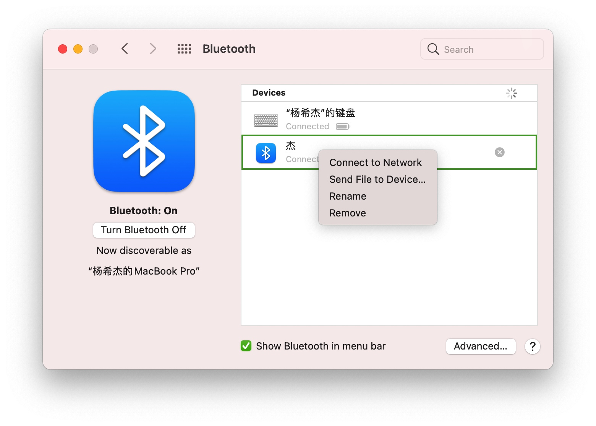

# Mac 连接安卓传输数据

> `v1.0` 210210 添加视频

> [Bilibili 视频版](https://www.bilibili.com/video/BV14A411M7Yh)

大家好，我是杨希杰。

这期教程我来讲讲如何在Mac和安卓之间传输数据。

如果你用Mac用的很爽，那我还是推荐你买一部iPhone。苹果的生态做的真的很好，比如iCloud、隔空投送、拍照获取、文件传输。不过如果你和我一样用的是Android，那可能稍微要折腾一些。

## 安卓投屏Mac

```bash
brew install --cask android-platform-tools
（或brew cask install android-platform-tools（brew 版本低于2.6））
brew install scrcpy
adb devices（查看已连接的设备）
scrcpy
```

[CSDN | Mac上投屏android_macOS+Android，如何用上投屏控制软件scrcpy](https://blog.csdn.net/weixin_39653448/article/details/111813429)

[CSDN | MacOS/BigSur安卓设备投屏控制Scrcpy安装，Mac上的Total Control](https://blog.csdn.net/cupster/article/details/111387005)

[GitHub | Genymobile / scrcpy README（中文）](https://github.com/Genymobile/scrcpy/blob/master/README.zh-Hans.md)

[小米手机开发者选项在哪？怎么打开关闭？](https://jingyan.baidu.com/article/d5c4b52bb1d28eda570dc558.html)

## 微信和QQ的文件传输助手

适合传输任何文件（不超过限制大小）。如文件过多可以使用压缩包

注意定期清理传输的文件，若不清理微信会长久保存占用存储空间。

不适合在网络不佳的情况下使用。

## 通过数据线传输数据

30MB/s

{width="300"}

[官网下载Android File Transfer](https://www.android.com/filetransfer/)

{width="300"}

## 通过蓝牙传输数据

速度非常慢，但操作简单，适合多个小文件（如图片）等在网络不佳的情况下使用。

### Mac to Android

{width="300"}

### Android to Mac

{width="300"}

{width="300"}

## 通过连接同一Wi-Fi共享Mac文件夹

{width="300"}

## 用U盘传输数据

{width="300"}

## 华为手机使用官方开发的应用

{width="300"}

## ftp

只要手机和电脑联网，就能相互获取数据文件

但是操作过于复杂连接也不够稳定。至少我很少用

{width="300"}
