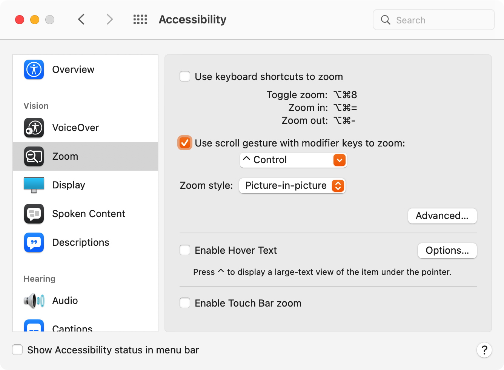

# macOS | 辅助功能开启缩放 Accessibility Zoom

背景：我会将mac的分辨率调到很高，这样能在一个屏幕中显示更多的内容。但是带来的问题是，局部的字可能会很小有点难以看清。得益于 `macOS` 优秀的分辨率管理，这种问题很难遇到。但是遇到的时候还是有些不爽。这里我推荐使用`辅助功能`里面的`缩放`。临时开启得到放大的局部画面。

系统：`macOS Big Sur 12.1`

第二行使用滚动手势开启后，在缩放开启后按住这个键双指上下滑动就可以放大或者缩小。

个人认为画中画模式是最好的。

点击 `Advanced...` 打开高级设置界面。

缩放框移动当鼠标移动是比较符合逻辑的一种缩放（好像你用放大镜一样）

平滑图像开启后可以获得好的缩放体验。
