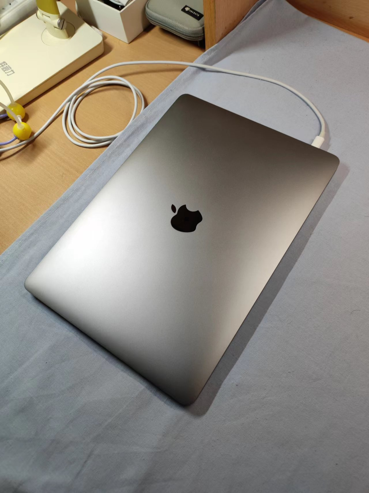

# 我与MacBook的故事

不知不觉MacBook已经陪伴我快三年了，平常使用觉得没什么，早已习惯了macOS的操作和Mac的风格。今天收拾宿舍桌面的时候把MacBook斜着放在一边，偶然看到了平常看不到的**苹果logo**，发现MacBook颜值是真的在线，就摆拍了几张。突然就被拽入回忆的漩涡，想起我与MacBook的故事。

{ width="400" }

{ width="400" }

{ width="400" }

## 使用：初高中的手机与电脑

上大学前我基本上不怎么懂电脑，只是在**使用**罢了，甚至都没使用太长时间。

我家买电脑很早，我记得小学的时候一家人一起玩什么开摩托的游戏、一起看奥运、和我妈打植物大战僵尸。但后来好像是因为我玩4399太久，所以老爸就给电脑设了密码；之后好像他俩也不怎么用电脑了，而且手机的功能也已经很强了，最后家里就把电脑收了。我记得当时我做过的傻事儿是把把文件放到回收站，因为我觉得这样父母发现不了lol。

之后主要就是玩手机，我还是挺能摸索的。我记得当时初中的时候会在B站下Vocaloid的曲子，然后把文件从B站目录移动到存储卡整理起来；还有各种软件的使用吧，印象深刻的大概是装Google框架和八门神器修改游戏数据？从来没看过什么教程，就只是手机到手然后一个地方一个地方点。

初中我是一直用手机，主要是玩游戏、听歌。高中高一高二我也有手机，主要是记日记、百词斩背单词。初中基本上没用过电脑，高中也就仅有几次帮老师打印讲义或者准备什么营的材料的时候用一下老师办公室的电脑。啊，对了，高一的时候我用电脑做过应用开发，那个什么校本课程，类似社团活动，老师叫我们用搭积木的方式（appinventor）编程，那个暑假我做了一个背单词的app，基本上是仿照百词斩，可以在手机上运行，效果还挺好的。好像高三的寒假来清华参加什么智能制造挑战赛，老师给团队三人发了三台ThinkPad，当时要用Ardunio的编程，但也只是很浅的了解下。除此以外再没有接触过电脑了，毕竟高中**学习是占据绝大多数部分的**；虽然有手机但我基本上也不怎么探索新功能了，主要是使用。

我记得当时高考完那个暑假特别忙，出分前我心如止水，想着要是没考上清华是不是要考虑复读，我记得那段时间完全没有考虑别的事情。出分后报完志愿，之后很快我就回到了母校，我作为班主任（真正意义上的）在母校组织一班准高中生参加夏令营，我记得那个持续挺久，好像有四周？所以结束的时候已经是我收到通知书的时候了，大概是七月底。

**到这时我都没有考虑要买电脑的事情**——我知道大学肯定需要电脑，但是我不知道要买什么电脑——现在的手机功能这么多了，不买电脑也可以吧？如果真的需要，我去了再买？我父母对这方面也不是很了解。当时我的一个舅舅说他那里有一台ThinkPad，说是来我们这边的时候给我；但后来开车过来的时候忘记了，也就不了了之。**八月中旬要开学军训，我快要走的时候的时候也完全没考虑过要买电脑**。

## 惊喜：MacBook Pro

那天就挺惊喜的，我快要开学走了，大概出发一周前，我舅舅（另一位舅舅）一家来我们家玩，白天到处逛，晚上去了石鼓山乘凉吹风看夜景。回家之后我舅说**给我一件礼物**，然后从行李箱拿出了一个纸盒子，上面印有电池的图标；从里面拿出了一个白盒子，说**给我台电脑**。我当时**完全没了解过MacBook**，我是用过iPad mini，苹果公司还是稍微知道的，**但我不知道苹果还造电脑**。

说了谢谢之后拿到房子，撕膜拿出电脑，开机应该是自动的，但我发现没法点击，然后又去请教了舅妈，她说那个触控板要摁下去，和手机一样轻点是不行的。那天晚上具体做了什么我已经记不得了，好像，开了个机就睡了，lol。

那天晚上躺在床上，我就突然来了兴致，在手机上查了关于MacBook的内容，好像说是**比较适合商务**？和ThinkPad差不多。好像还挺6的。然后去官网看了下价格，好像不便宜；但当时我对价格实在没什么概念，也就没怎么考虑。

我印象中的第一次使用应该是看B站，我看了Mac云课堂休康老师的所有教程迅速上手了macOS，最大的感受是**流畅**。当时的系统是Mojave，切换桌面啊、Dock栏动画啊，我只能说**舒服**（补充：之后从Big Sur开始，切换桌面越来越卡ww）。印象中比较重要的一次使用是在去清华之前注册了微信的公众号，然后发了自己的随笔记和一些文章上去，我记得还自己做了随笔记的封面（彩虹色的罗马数字）（补充：之后觉得微信公众号太封闭用了CSDN和简书）。

那时我并不知道这台小小的MacBook能让我怎样去迎接大学生活、也不知道它能带给我怎样的收获。直到，**我进入了清华园**。

## 舒适与成长：MacBook in THU

先说结论吧，我现在大三刚结束，**在我的认知中，从上大学到现在我的成长，一半算作清华本科教育的功劳，一半算作这台MacBook的功劳**。

大学学习是很重要的，MacBook给我带来的第一个优势就是**效率**。虽然我大学前用的电脑都是Windows，但我那时并不知道macOS相比Windows有多人性化。随着个性化配置的添加（MacBook对我来说相当于玩具，闲了就折腾配置），**macOS越用越顺手**，当时我的感觉是，相比Windows，**macOS能让我的学习效率翻一倍**。

第二个优势算是可以**装个逼**吧，一个是MacBook比较**稀有**，我们班三十人左右，也就只有三个人在用；另一个是MacBook**颜值在线**，去图书馆感觉和周围环境挺般配的，而且**便携**也是很好的优点；不过大概一两个月之后注意力就还是放到生产力上了，装逼并没有那么重要；另外就是19款MacBook Pro的蝶式键盘在最开始的时候确实是让我体验到了敲木头的感觉（三个月后大致习惯了ww）。

第三个就要说说**生产力**了，这和上面所说的效率不尽相同——借助macOS，我先后学了**FCPX视频剪辑、各种语言编程、虚拟机的原理和使用、iOS/macOS应用开发、Linux命令、网站开发、GitHub、Markdown、PT、硬盘、视频编码、LaTeX、个人网站部署、Sketch 2D设计、Blender 3D设计、Metal**……**这些是我去创造新事物的基础**——我投稿了很多剪辑的视频、投稿了我想录制的教程；了解开源、参与开源，让自己和整个世界接轨；尝试做设计，补充着我不甚了解但所感兴趣的领域；参加比赛，收获实际的项目经验……macOS几乎不能玩游戏是真的，但它上面安装的各种软件让我**玩的非常开心**，**也收获了很多技能**。我想这也是手机和电脑最大的区别（这是我觉得iPhone很贵的原因，因为我并不认为iPhone是生产力），也是iPad Pro和MacBook Pro最大的区别。

第四个要说**对电脑的理解**。我之前说过，我上大学之前用电脑和手机只是使用，但大学之后，我通过macOS了解了程序、了解了GUI图形界面、了解了操作系统，这也很大程度**激发了我对计算机学科的兴趣**，我也选修了计算系的一些课程，因为想知道**到底如何才能构建出像macOS这样人性化的操作系统**。另一方面，苹果的每次更新也**让我对相关的技术有了关注**，比如每年的WWDC，还有发布会。我之后应该也会去做和计算机更贴近的事情，电子虽然也觉得很不错，但感觉自己还是更适合计算机。

最后其实是最重要的，**人脉**。来了清华这样的平台，不多认识一些人，太可惜了。我大一下，报名电子系社工骨干培养计划**扬帆计划**，那时大家都在家线上学习，我们的面试也是线上。说实话我的成绩还行，但是和录取的人数相比有点难。但当时我们无领导小组讨论问题，我开了屏幕共享，共享了Xmind思维导图，基本上算是组织/带领了整个讨论，最终也成功入选这一计划。**我通过扬帆计划认识了电子系很多优秀的人，也懂了很多事情。**这次面试让我印象深刻——工具的使用是很重要的，人的定义不也是从这里来吗？**macOS让我有了很多趁手的工具，让我有了一些额外的机会。**

另一件事儿是**iOS Club**。清华成立iOS Club比较晚，我算是第二年看到招新海报加入。怎么说呢，我很向往的日本社团生活，就此展开。现在想想，真的做了很多事情——和初届社长他们深夜聊到两点多讨论社团发展、成为开发部部长组织教学活动、在招新活动上介绍社团、在CCCC比赛中组织应用设计开发，所有的人，我想都是通过苹果产品联系在一起，而我则**通过MacBook加入了这一群体**。我认识到已经有App Store运营项目的贵系大佬，认识到每天都在做项目的美院社长，认识了一群对新技术有热情的人，苹果发布会我们有时会熬夜一起看；更重要的是，**了解了设计的思想**。我在高中已经习惯了严谨，上大学习惯了做工程；但是我不懂设计，我不不甚知道在动手前先想好，有个宏观的整体把握之后再动手。和美院的同学交流、实际参加比赛，我明白了设计（不狭义指美术设计）是多么的重要，**设计是**一切创新的起点，这种思想让我串起我所学习的所有知识，进一步加以应用。苹果是全球数一数二的科技公司，但它同时也是数一数二的设计公司——我必须说，**如果没有MacBook，没有通过Mac认识的人，我可能很难在电子系的日常中获得这种宝贵的思想。**

## 回顾：价格与价值

这台电脑，当时购买的价格为**14500**，说实话，虽然是亲戚送的，但真的**很贵**；一台MacBook，顶三台同配置Windows笔电。虽然我现在有时也会抱怨256G存储不够用、8G内存有些卡，但这些都不重要——**有和无是两种概念**——因此我很感激当时送我这台MacBook的舅舅，真的让我大学生活高效、多元了不少。有了这样的收获，回到之前所说，**我觉得我这三年的成长，一半是清华本科教育 一半是MacBook**。如果14500就能买到相当于清华三年的本科教育的成长，那是否又太**值**了呢？何况我觉得这台电脑可以一直用下去，这样的屏幕素质，我觉得再过五年也还算是顶尖吧；过两年左右卡到影响效率的话就带回家给父母玩了，自己换一台32G2T的M系列Pro。

Mac、macOS**让我始终保持对新科技的接受与自如**、**让我总是在探索中折腾**、**让我发现和定义新的创意**，这些我想是会相伴我一生的。只能说，很幸运与MacBook的邂逅！
