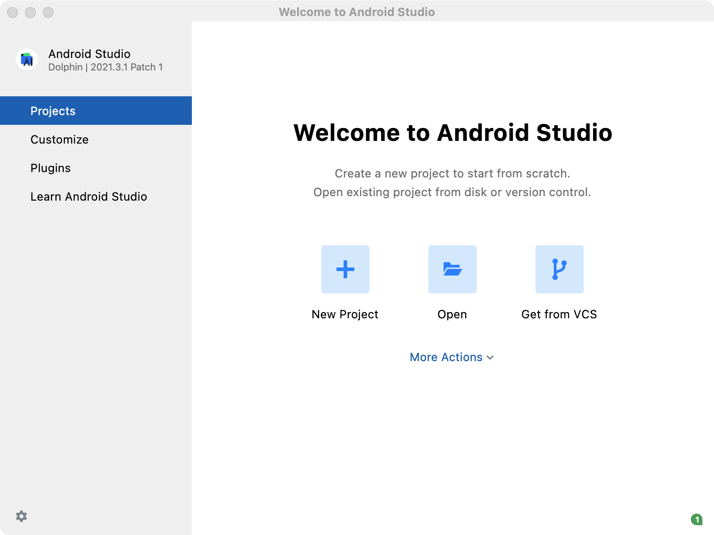
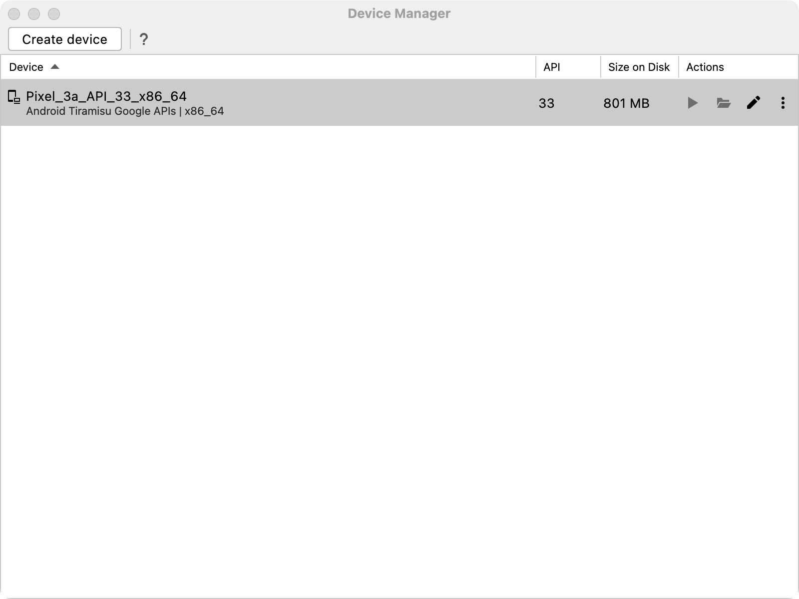
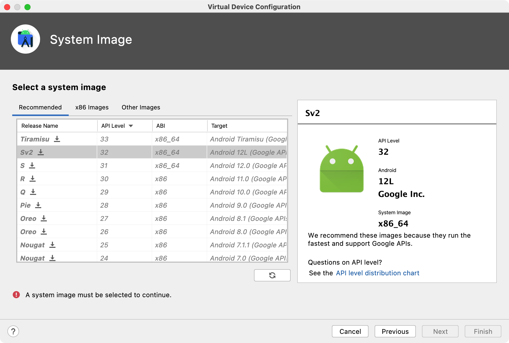
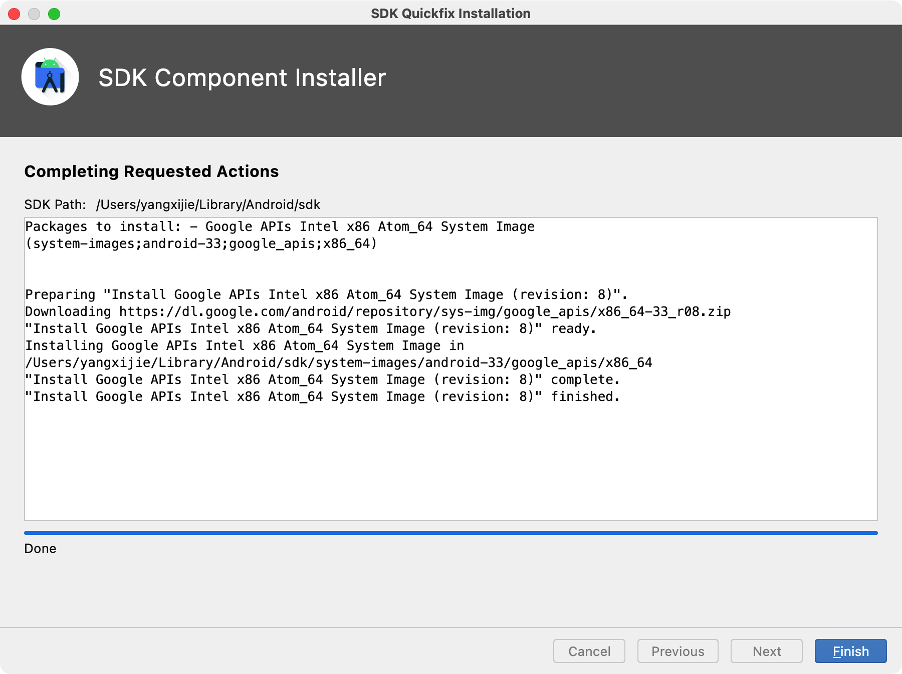
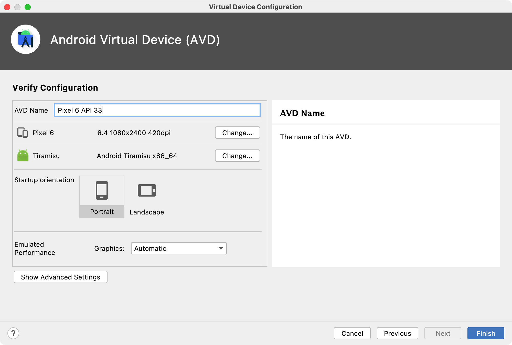
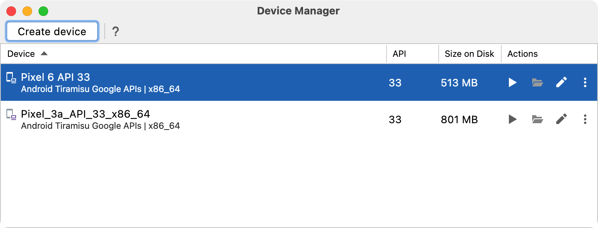

# 在 macOS 上创建打开 Android 模拟器进行调试

安装 `Android Studio` 并打开。

开始界面中间点击 `More Actions > Virtual Device Manager`。



可以看到这里已经有了一个，点击右侧三角形播放键开始运行。



或者点击左上角 `Create device` 创建一个新的设备。比如我这里选择 `Pixel 6`，选择镜像 `Tiramisu` 进行下载。选择好之后选择 `Finish` 即可创建。









```
$ flutter devices
4 connected devices:

sdk gphone64 x86 64 (mobile) ...
iPhone 13 221223 (mobile) ...
macOS (desktop) ...
Chrome (web) ...
```


在工程文件夹中使用下面的命令运行项目：

```
$ flutter run -d sdk
```

## References

- https://docs.flutter.dev/get-started/install/macos#android-setup
