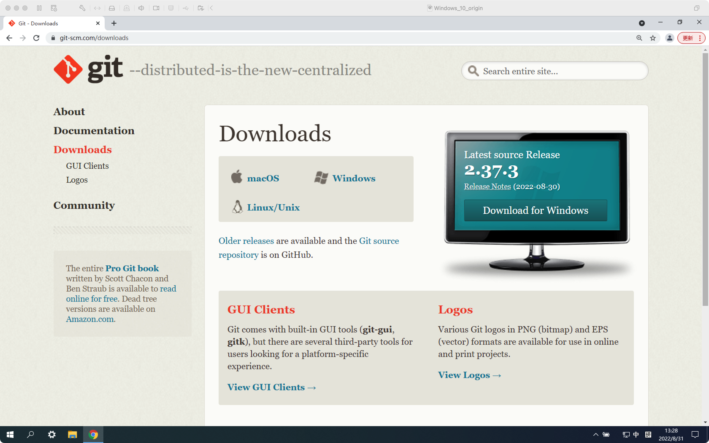
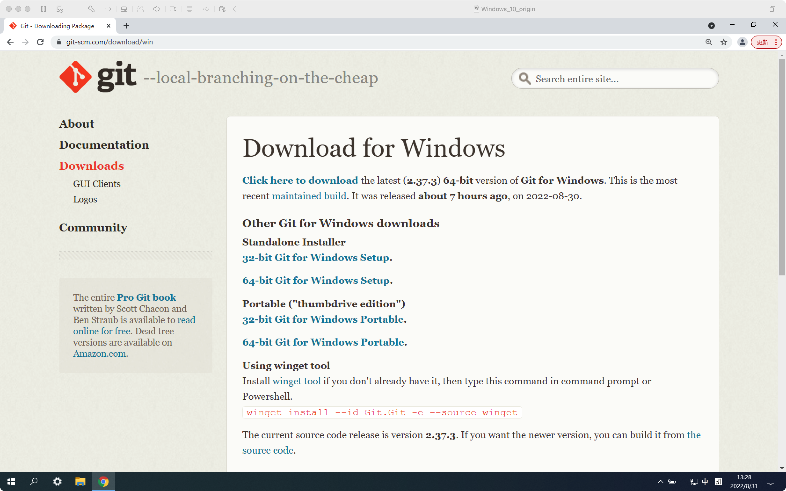
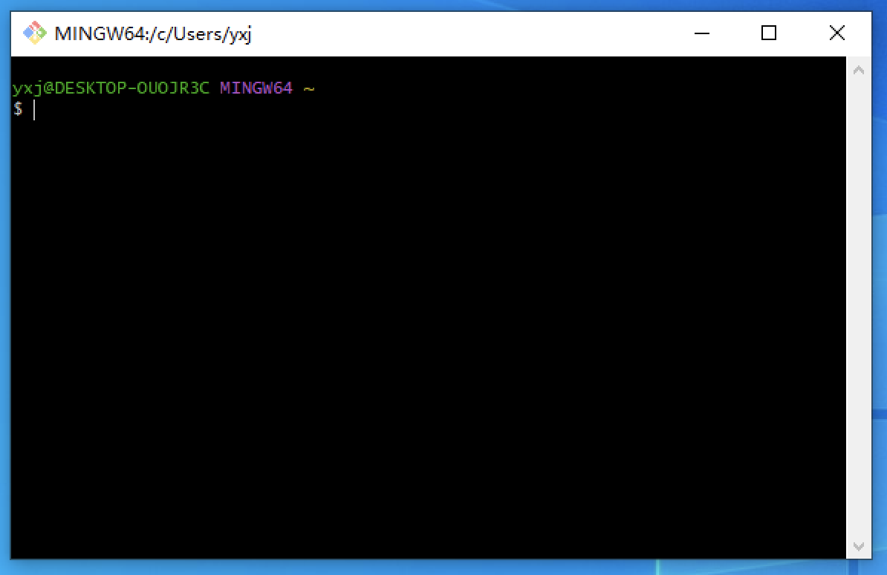

# 在Windows上安装Git

## 下载Git安装包

打开网址 https://git-scm.com/downloads

点击右侧 `Download for Windows`

选择 `Other Git for Windows downloads` 中的 `Standalone Installer` 中的 `64-bit Git for Windows Setup`，即可开始下载Git安装包

下载好之后获得`Git-2.37.3-64-bit.exe`（我这里存储到桌面）

## 安装Git

双击打开`Git-2.37.3-64-bit.exe`，点击`是`

一路 `Next`，最后点击 `Install`，然后等待安装完毕

出现下图则说明已经安装成功：

在最后一个界面，第一个 `Launch Git Bash` 可以打开接下来我们要与 Git 交互的命令行界面，**我们需要选中**；第二个 `View Release Notes` 可以查看 `Git` 的更新信息，我们没必要查看，所以**取消勾选**。

之后点击 `Finish`。我们可以看到这样的一个窗口。

## Git Bash 及命令行入门

如果上一步勾选了 `Launch Git Bash`，则可以直接在窗口中操作。如果忘记勾选或者不小心关掉了，可以在桌面右键 `Git Bash Here` 打开 `Git Bash`。

### 自用配置

右键菜单栏，点击 `Options` 里面可以调整字体大小。更方便的是使用 `ctrl -` 和 `ctrl =` 来进行控制字体大小。

### 命令行入门

#### 普通命令

核心：掌握一下命令

- date 了解程序有输入和输出
- clear 清屏
- 

#### 文件系统

核心：

- 了解文件系统是一个树的结构
- pwd ls
    - cd时tab补全
    - ctrl C 结束或清除当前命令
    - 按上键调出之前的命令
- 文件路径的表示
- cd
- 学会创建文件夹
