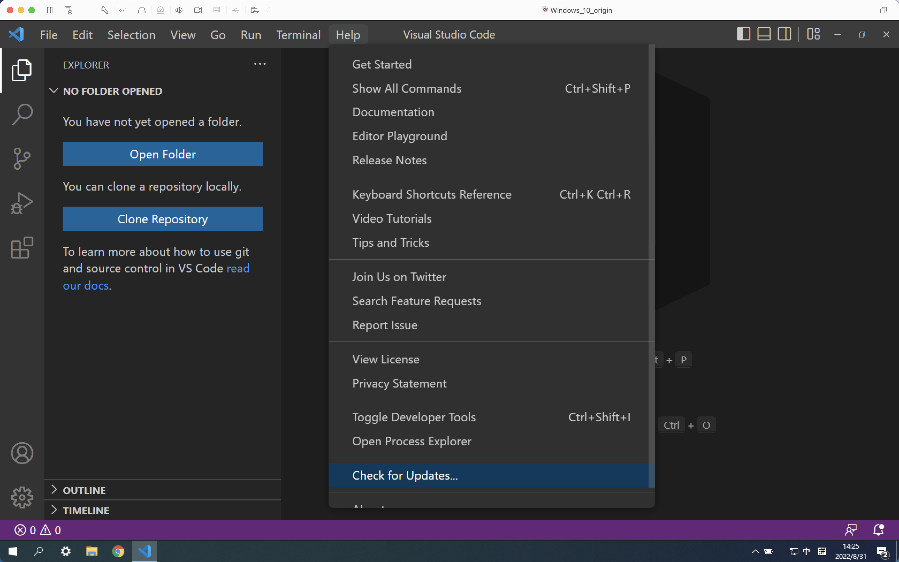
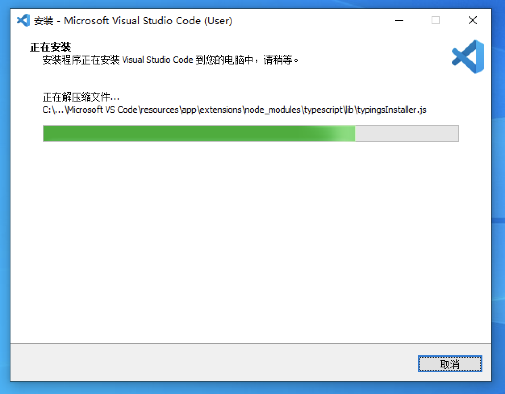

# 安装VSCode和Markdown插件

> 暂时不想安装 VSCode，也可以使用在线的 Markdown编辑器。如 <https://stackedit.io/app#>

## 安装 VSCode

> 如果已经安装了 VSCode，推荐检查一下更新保持最新版本：
> 
> 

打开 <https://code.visualstudio.com/Download>

按照自己的电脑操作系统选择安装包进行下载。

下载好后双击安装即可。

推荐在安装过程中，勾选这几项：

其他的直接下一步就好

可以看到安装已经完成

## 安装插件

### 中文插件

如果需要将 VSCode 调为中文，可以在插件商店（左侧第五个图标）中搜索 `Chinese`，选择中文简体安装即可。

### Markdown插件

在插件商店（左侧第五个图标）中搜索 `Markdown`，可以看到有一个 `Markdown All in One` 的插件，安装即可。

插件会提供如 Markdown预览、快捷键 等 在编辑Markdown时很实用的功能。
